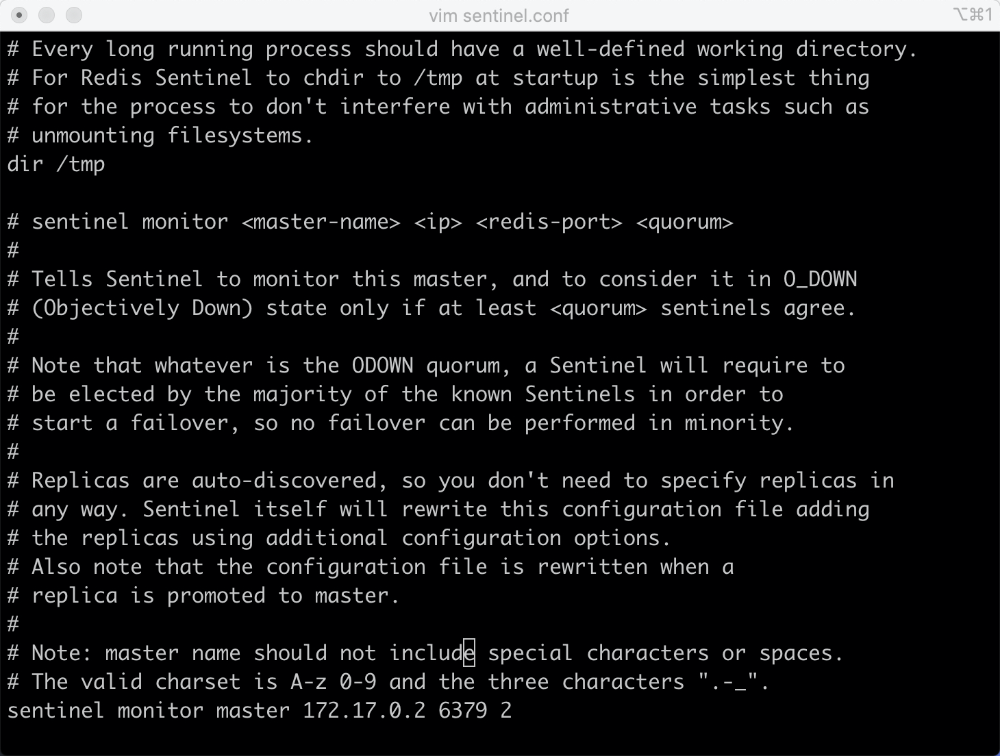
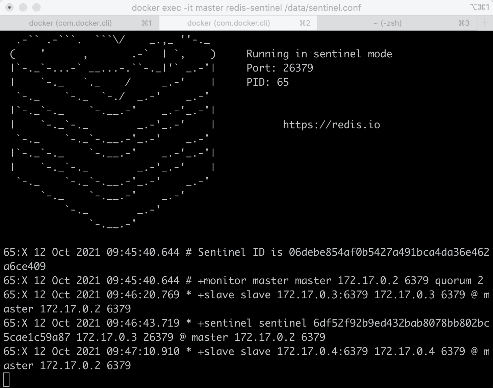
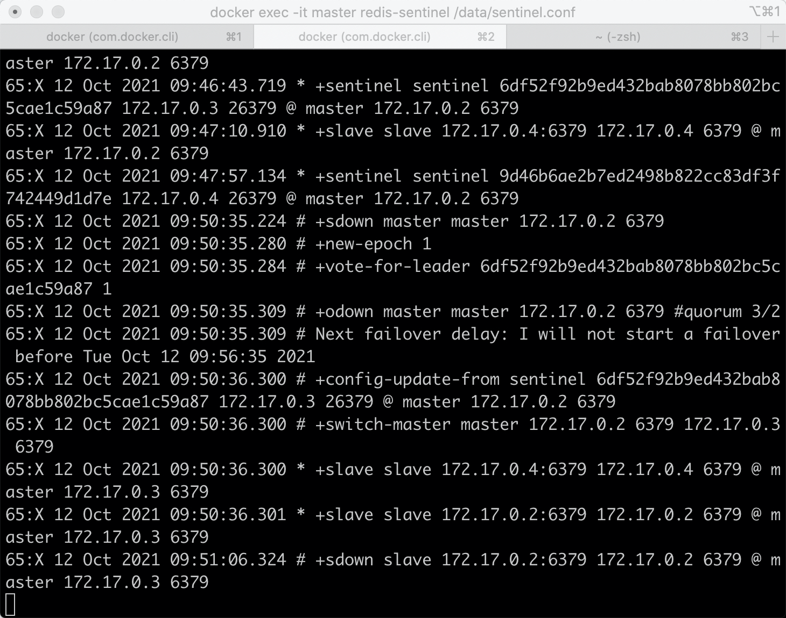
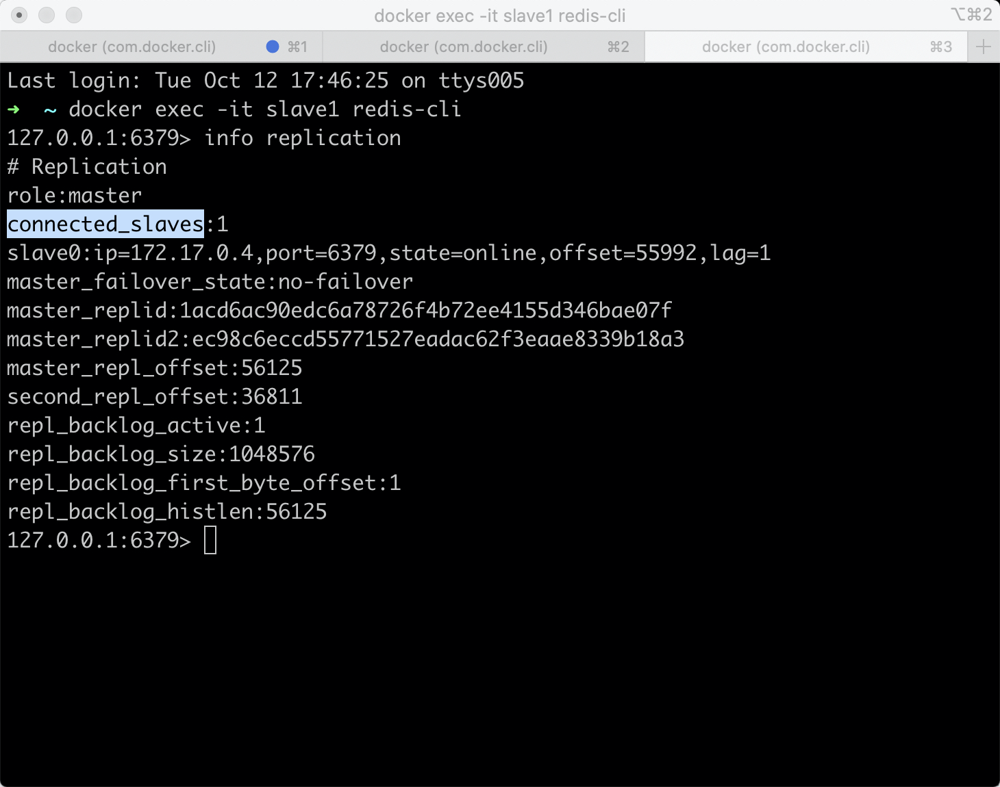
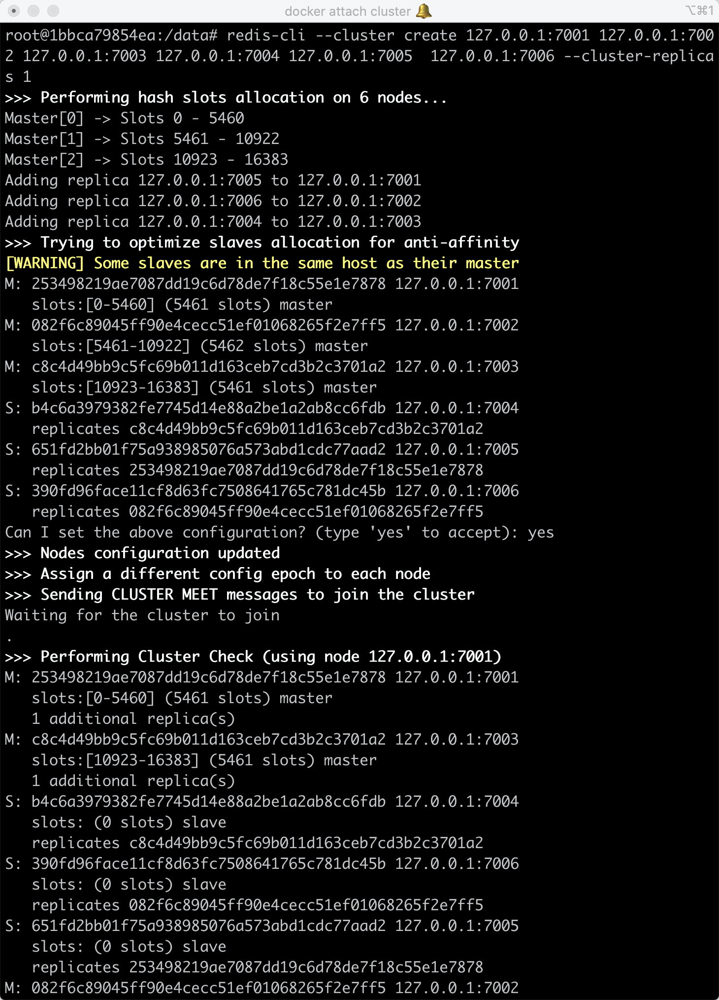
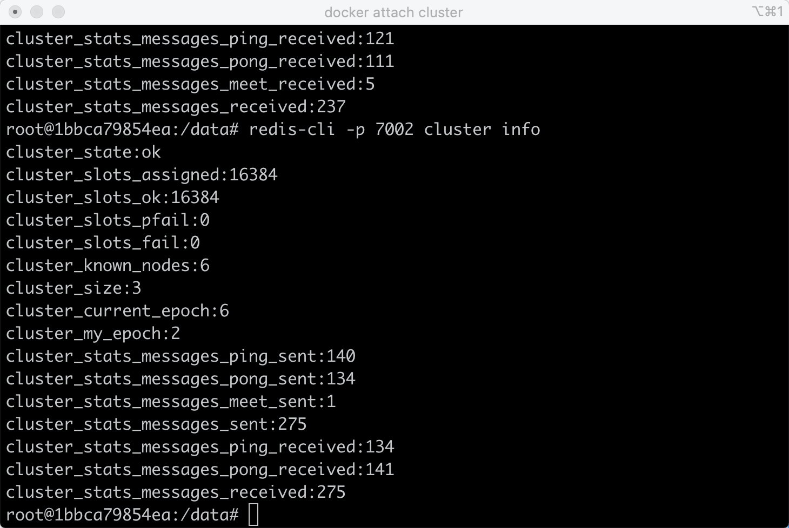
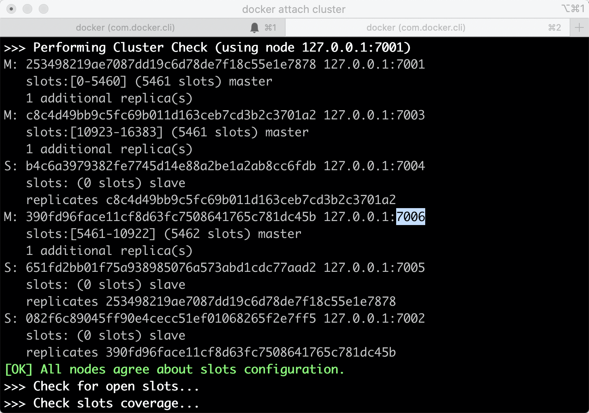
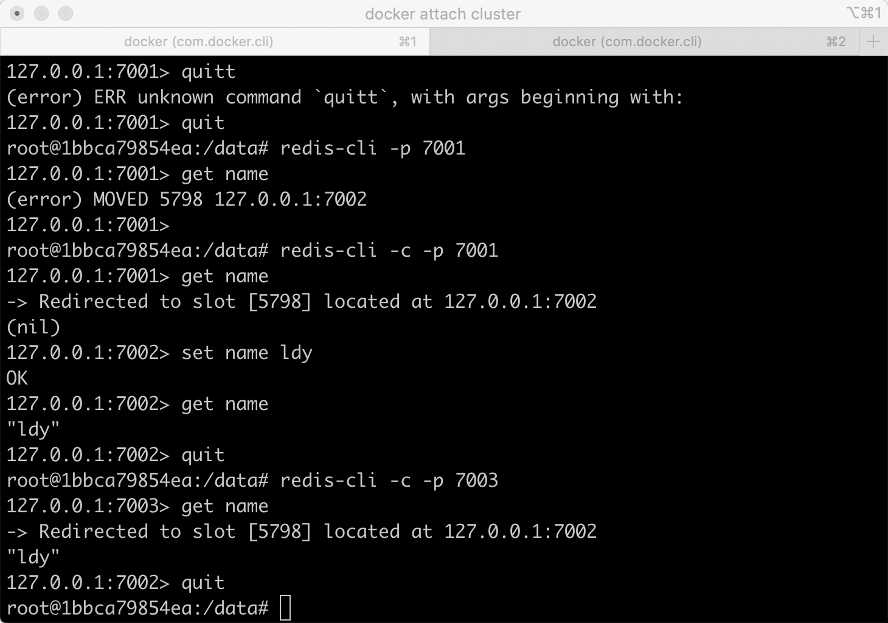
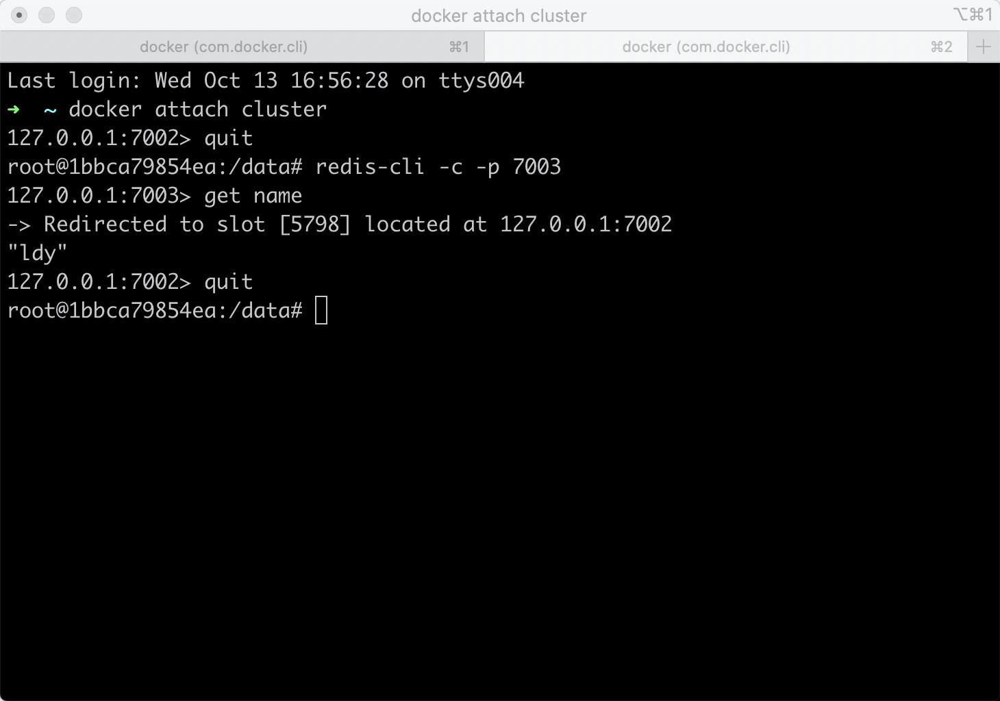
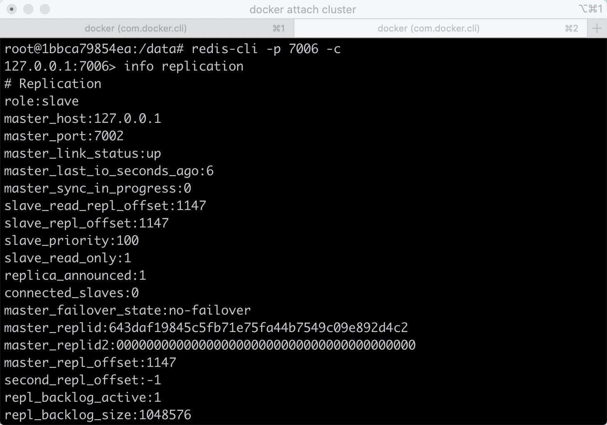

## Redis高可用性保证

### 1. Redis Sentinel（哨兵）架构下的高可用
Redis的主从复制下，一旦主节点由于故障不能提供服务，需要人工将从节点晋升为主节点，同时还要通知应用方更新主节点地址，对于很多应用场景这种故障处理的方法是无法接受的。但是Redis从2.8开始正式提供了Redis Sentinel（哨兵）架构来解决这个问题。

Redis Sentinel是一个分布式架构，其中包含若干个Sentinel节点和Redis数据节点，每个Sentinel节点会对数据节点和其余Sentinel节点进行监控，当它发现节点不可达时，会对节点做下线标识。如果被标识的是主节点，它还会和其他Sentinel节点进行“协商”，当大多数Sentinel节点都认为主节点不可达时，它们会选举出一个Sentinel节点来完成自动故障转移的工作，同时会将这个变化通知给Redis应用方。整个过程完全是自动的，不需要人工来介入，所以这套方案很有效地解决了Redis的高可用问题。

#### 1.1 实现原理：

#### 1.1.1 监控
三个定时监控任务

1）每隔10秒，每个Sentinel节点会向主节点和从节点发送info命令获取最新的拓扑结构。

2）每隔2秒，每个Sentinel节点会向Redis数据节点的__sentinel__:hello频道上发送该Sentinel节点对于主节点的判断以及当前Sentinel节点的信息，同时每个Sentinel节点也会订阅该频道，来了解其他Sentinel节点以及它们对主节点的判断。

3）每隔一秒，每个Sentinel节点会向主节点、从节点、其余Sentinel节点发送一条ping命令做一次心跳检测，来确认这些节点当前是否可达。

#### 1.1.2 下线的判断
主观下线

因为每隔一秒，每个Sentinel节点会向主节点、从节点、其余Sentinel节点发送一条ping命令做一次心跳检测，当这些节点超过down-after-milliseconds没有进行有效回复，Sentinel节点就会对该节点做失败判定，这个行为叫做主观下线。

客观下线

当Sentinel主观下线的节点是主节点时，该Sentinel节点会向其他Sentinel节点询问对主节点的判断，当超过<quorum>个数，那么意味着大部分的Sentinel节点都对这个主节点的下线做了同意的判定，于是该Sentinel节点认为主节点确实有问题，这时该Sentinel节点会做出客观下线的决定。

#### 1.1.3 新节点选举
领导者Sentinel节点选举

Raft算法：假设s1(sentinel-1)最先完成客观下线，它会向其余Sentinel节点发送命令，请求成为领导者；收到命令的Sentinel节点如果没有同意过其他Sentinel节点的请求，那么就会同意s1的请求，否则拒绝；如果s1发现自己的票数已经大于等于某个值，那么它将成为领导者。

#### 1.1.4 故障转移
1）领导者Sentinel节点在从节点列表中选出一个节点作为新的主节点

2）选取与主节点复制相似度最高的从节点：

slave 的 priority 设置的越低，优先级越高；

同等情况下，slave 复制的数据越多优先级越高；

相同的条件下 runid 越小越容易被选中。

3）领导者Sentinel节点让剩余的从节点成为新的主节点的从节点

4）Sentinel节点集合会将原来的主节点更新为从节点，并保持着对其关注，当其恢复后命令它去复制新的主节点

### 1.2 实验

编辑redis-sentinel.conf, 
```
bin 0.0.0.0
sentinel monitor master 172.17.0.2 6379 2
```
所有mymaster修改为主节点的信息，复制给所有节点

redis-sentinel redis-sentinel.conf启动

关闭主节点，模拟宕机



## 2.Redis Cluster（集群）下的高可用
Redis Cluster 使用分片机制，在内部分为 16384 个 slot 插槽，分布在所有 master 节点上，每个 master 节点负责一部分 slot。数据操作时按 key 做 CRC16 来计算在哪个 slot，由哪个 master 进行处理。数据的冗余是通过 slave 节点来保障。
#### 2.1 实现原理


#### 2.1.1 下线的判断
主观下线

集群中每个节点都会定期向其他节点发送ping消息，接受节点回复ping消息作为响应。如果在cluster-node-timeout时间内通信一直失败，则发送节点会认为接收节点存在故障，把接受节点标记为主观下线(pfail)状态。

客观下线

1)当某个节点判断另一个节点主观下线后，相应的节点状态会跟随消息在集群内传播。

2)假设节点a标记节点b为主观下线，一段时间后节点a通过消息把节点b的状态发送到其他节点，当其他节点收到消息并解析出消息体中含有b的pfail状态，把节点b加入下线报告链表；

3)当某一节点c收到节点b的pfail状态时，此时有超过一半的槽主节点都标记了节点b为pfail状态时，则标记故障节点b为客观下线；

4)向集群广播一条pfail消息，通知集群内的所有节点标记故障节点b为客观下线状态并立刻生效，同时通知故障节点b的从节点触发故障转移流程。


#### 2.1.2 故障修复
1)资格检查

若从节点与主节点断线时间超过一定时间，则不具备资格。

当从节点符合故障转移资格后，要等待一段选举时间后才开始选举。

在故障节点的所有从节点中，复制偏移量最大的那个从节点最先开始（与主节点的数据最一致）进行选举，然后是次大的节点开始选举.....剩下其余的从节点等待到它们的选举时间到达后再进行选举。

3)发起选举


    1.将自己记录的集群currentEpoch加1，并广播FAILOVER_AUTH_REQUEST信息

    2.其他节点收到该信息，只有master响应，判断请求者的合法性，并发送FAILOVER_AUTH_ACK，对每一个epoch只发送一次ack

    3.尝试failover的slave收集FAILOVER_AUTH_ACK


4)选举投票

只有持有槽的主节点才具有一张唯一的选票，从从节点收集到N/2 + 1个持有槽的主节点投票时，从节点可以执行替换主节点操作

5)替换主节点

当从节点收集到足够的选票之后，触发替换主节点操作：

    当前从节点取消复制变为主节点；

    撤销故障主节点负责的槽，并把这些槽委派给自己；

    向集群广播自己的pong消息，通知集群内所有的节点当前从节点变为主节点并接管了故障主节点的槽信息。


### 2.2 实验
单主机即可进行模拟
```dockerfile
docker run -it --name cluster -d -p 30003:6379 redis /bin/bash
mkdir -p /data/700{1..6}
```
同样修改redis.conf文件：

```dockerfile
port 7001     
cluster-enabled yes             #打开集群设备
cluster-config-file nodes.conf  #node信息文件
cluster-node-timeout 5000       #延时时间
appendonly yes
daemonize yes                   #后台运行
pidfile /data/7001/redis.pid    ##pid文件存放目录
logfile /data/7001/redis.log    ##日志存放目录
```
```dockerfile
docker cp redis.conf cluster:/data/7001
docker attach cluster
cd /data/7001
redis-server redis.conf
ps ax
```
创建集群
```dockerfile
redis-cli --cluster create 127.0.0.1:7001 127.0.0.1:7002 127.0.0.1:7003 127.0.0.1:7004 127.0.0.1:7005  127.0.0.1:7006 --cluster-replicas 1
```

集群状态
```dockerfile
redis-cli -p 7001 cluster info
```

```dockerfile
redis-cli --cluster check 127.0.0.1:7001
```

节点状态

添加数据
```dockerfile
redis-cli -c -p 7001
```

查询数据

关闭节点2



