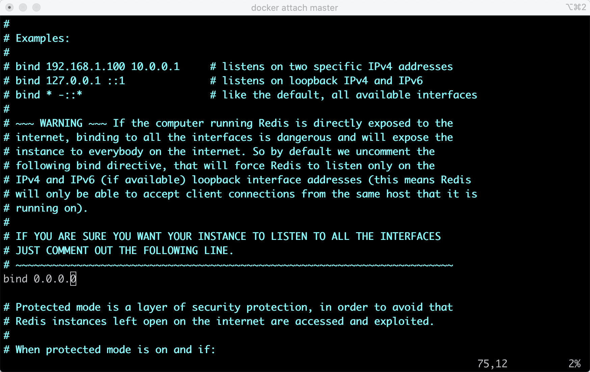
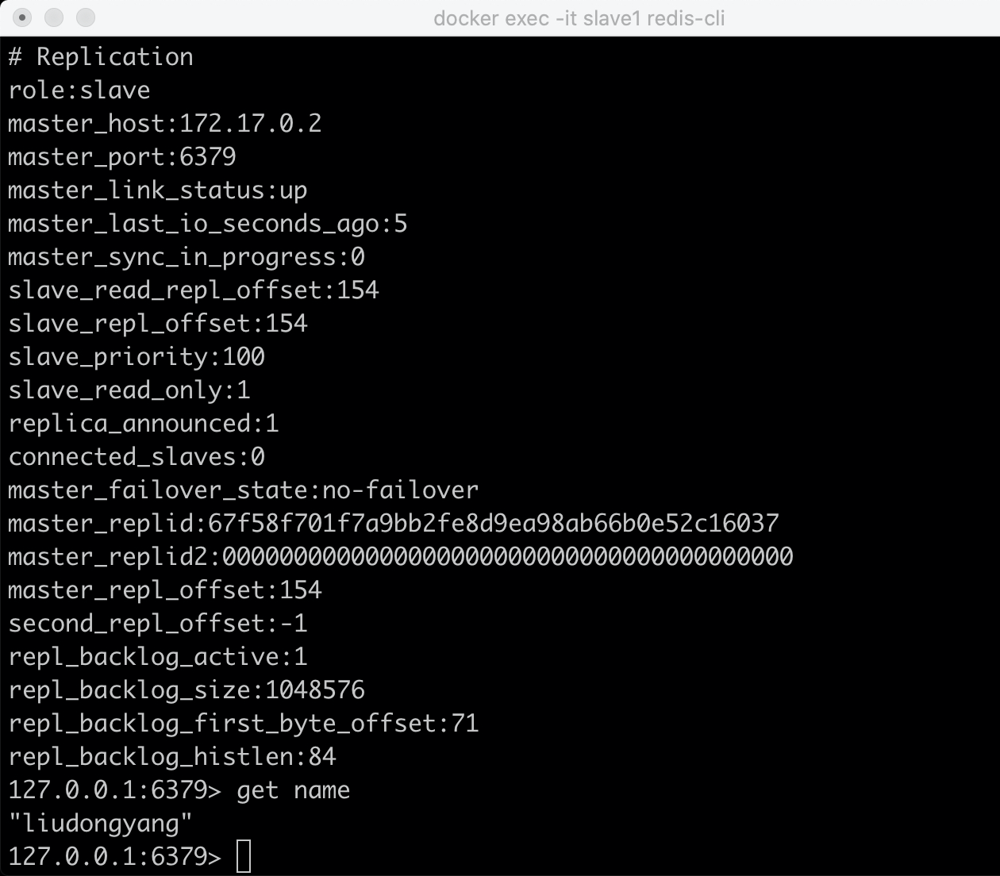
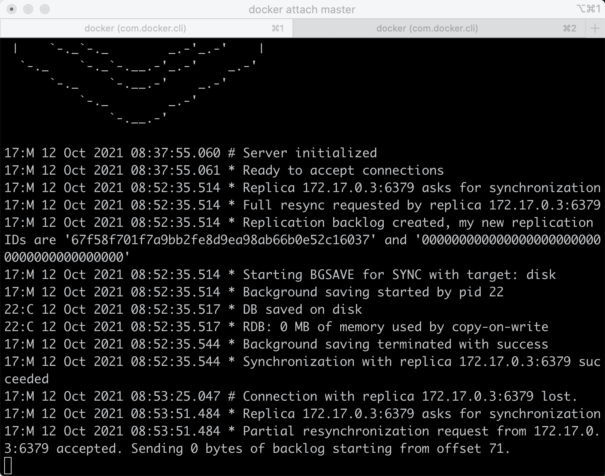
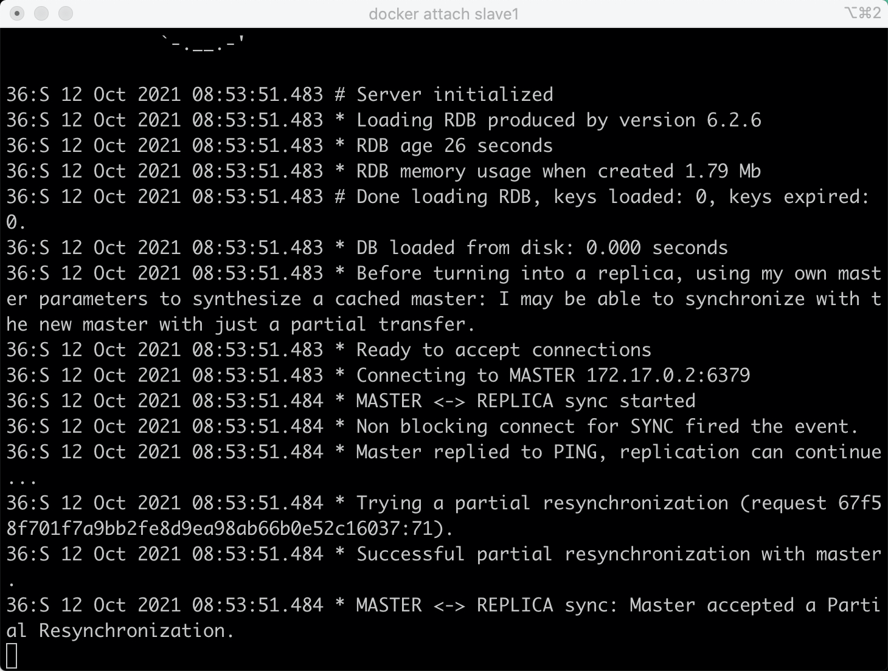

## Redis主从同步机制

Redis主从同步。数据可以从主服务器向任意数量的从服务器上同步，从服务器可以是关联其他从服务器的主服务器。这使得Redis可执行单层树复制。存盘可以有意无意的对数据进行写操作。由于完全实现了发布/订阅机制，使得从数据库在任何地方同步树时，可订阅一个频道并接收主服务器完整的消息发布 记录。同步对读取操作的可扩展性和数据冗余很有帮助。

### 1. 原理
Redis的主从结构可以采用一主多从或者级联结构，Redis主从复制可以根据是否是全量分为全量同步和增量同步。

全量同步：

Redis全量复制一般发生在Slave初始化阶段，这时Slave需要将Master上的所有数据都复制一份。具体步骤如下：

1）从服务器连接主服务器，发送SYNC命令；

2）主服务器接收到SYNC命名后，开始执行BGSAVE命令生成RDB文件并使用缓冲区记录此后执行的所有写命令；

3）主服务器BGSAVE执行完后，向所有从服务器发送快照文件，并在发送期间继续记录被执行的写命令；

4）从服务器收到快照文件后丢弃所有旧数据，载入收到的快照；

5）主服务器快照发送完毕后开始向从服务器发送缓冲区中的写命令；

6）从服务器完成对快照的载入，开始接收命令请求，并执行来自主服务器缓冲区的写命令；

完成上面几个步骤后就完成了从服务器数据初始化的所有操作，从服务器此时可以接收来自用户的读请求。

增量同步：
Redis增量复制是指Slave初始化后开始正常工作时主服务器发生的写操作同步到从服务器的过程。
增量复制的过程主要是主服务器每执行一个写命令就会向从服务器发送相同的写命令，从服务器接收并执行收到的写命令。

## 2. 同步策略
主从刚刚连接的时候，进行全量同步；全同步结束后，进行增量同步。当然，如果有需要，slave 在任何时候都可以发起全量同步。redis 策略是，无论如何，首先会尝试进行增量同步，如不成功，要求从机进行全量同步。

## 3. 实验

### 3.1 环境
docker
```dockerfile
docker pull redis
docker run -it --name master -d -p 30000:6379 redis /bin/bash
docker run -it --name slave1 -d -p 30001:6379 redis /bin/bash
docker run -it --name slave2 -d -p 30002:6379 redis /bin/bash
docker ps -a 
docker images
docker inspect master
docker exec -it master redis-cli
```
修改redis.conf文件，bind修改为0.0.0.0, 对于slave节点，redis.conf追加slaveof master_ip:6379。

执行docker attach master 依次进入master、slave1、slave2执行redis-server redis.conf

### 3.2 启动时同步
info replication



### 3.3 运行时同步
在master节点执行命令，在从节点查看
