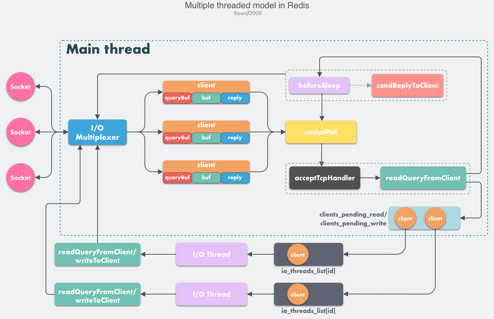

# Redis 网络模型

## 单线程模型

在 v6.0 以前，Redis 的核心网络模型是单线程的，开发者对此给出的理由是 Redis 是 I/O 密集型而非 CPU 密集型的软件，CPU 通常不是 Redis 的性能瓶颈。客户端和服务端之间的网络延迟才是限制 Redis 性能的主要原因。此外，操作系统层面上采用单线程的原因包括：

-   避免上下文切换的开销；
-   避免同步机制（如锁）带来的开销；
-   多线程模型会使得代码更复杂、可维护性更差。

### 单线程事件循环

单线程 Redis 网络模型是一个典型的 Reactor 模型，利用 epoll/select/kqueue 等多路复用技术，在单线程的事件循环中不断去处理事件（客户端请求），最后回写响应数据到客户端。

>   #### Reactor 模式
>
>   reactor 模式是一种用于处理并发服务请求的设计模式。一个或多个输入的服务请求交由服务处理程序进行处理，它将传入的请求进行多路分解，并将它们同步分派到相关联的请求处理程序中。
>
>   Reactor 模型由三个主要部分构成：
>
>   -   Acceptor：处理客户端的的连接事件；
>   -   Reactor：把 I/O 事件分配给对应的 handler；
>   -   Handler：处理非阻塞的任务


Redis 网络模型中的构成包括：

1.   **socket**：客户端通过 **socket** 与服务端建立网络通道，请求和回复通过它进行收发；
2.   **client**：客户端在 Redis 服务端中的结构体，它存储了客户端的相关信息，包括但不限于`封装的套接字连接 -- *conn`，`当前选择的数据库指针 -- *db`，`读入缓冲区 -- querybuf`，`写出缓冲区 -- buf`，`写出数据链表 -- reply`等；
3.   **aeApiPoll**：I/O 多路复用 API，是基于 `epoll_wait/select/kevent` 等系统调用的封装，监听等待读写事件触发，然后处理，它是事件循环（Event Loop）的核心函数，是事件驱动得以运行的基础；
4.   **acceptTcpHandler**：连接应答处理程序，底层使用系统调用 `accept` 接受来自客户端的新连接，并为新连接注册绑定命令读取处理程序，以备后续处理新的客户端 TCP 连接；除了这个处理程序，还有对应的 `acceptUnixHandler` 负责处理 Unix Domain Socket 以及 `acceptTLSHandler` 负责处理 TLS 加密连接；
5.   **readQueryFromClient**：命令读取处理程序，解析并执行客户端的请求命令；
6.   **beforeSleep**：事件循环中进入 **aeApiPoll** 等待事件到来之前会执行的函数，其中包含一些日常的任务，比如把 `client->buf` 或者 `client->reply` 中的响应写回到客户端、持久化 AOF 缓冲区的数据到磁盘等，与之对应的还有一个 **afterSleep** 函数，在 aeApiPoll 之后执行；
7.   **sendReplyToClient**：命令回复处理程序，当一次事件循环之后写出缓冲区中还有数据残留，则这个处理程序会被注册绑定到相应的连接上，等连接触发写就绪事件时，它会将写出缓冲区剩余的数据回写到客户端。

ae 是 Redis 内部的一个高性能事件库，基于 `epoll/select/kqueue/evport` 四种事件驱动技术在多平台上实现高性能事件循环模型。Redis 的核心网络模型构筑在 ae 之上，包括 I/O 多路复用、各类处理程序的注册绑定等。

单线程的 Redis 网络模型的工作流程为：

1.   Redis 服务器启动，开启主线程事件循环（Event Loop），注册 `acceptTcpHandler` 连接应答处理程序到配置文件指定的监听端口对应的文件描述符，等待新连接到来；
2.   客户端和服务端建立网络连接；
3.   `acceptTcpHandler` 被调用，主线程使用 ae 的 API 将 `readQueryFromClient` 命令读取处理程序绑定到新连接对应的文件描述符上，并初始化一个 `client` 对象绑定这个客户端连接；
4.   客户端发送请求命令，触发读就绪事件，主线程调用 `readQueryFromClient` 通过 socket 读取客户端发送过来的命令存入 `client->querybuf` 读入缓冲区；
5.   接着调用 `processInputBuffer`，在其中使用 `processInlineBuffer` 或者 `processMultibulkBuffer` 根据 Redis 协议解析命令，最后调用 `processCommand` 执行命令；
6.   根据请求命令的类型（SET, GET, DEL, EXEC 等），分配相应的命令执行器去执行，最后调用 `addReply` 函数族的一系列函数将响应数据写入到对应 `client` 的写出缓冲区：`client->buf` 或者 `client->reply` ，`client->buf` 是首选的写出缓冲区，固定大小 16KB，一般来说可以缓冲足够多的响应数据，但是如果客户端在时间窗口内需要响应的数据非常大，那么则会自动切换到 `client->reply` 链表上去，使用链表理论上能够保存无限大的数据（受限于机器的物理内存），最后把 `client` 添加进一个 LIFO 队列 `clients_pending_write`；
7.   在事件循环（Event Loop）中，主线程执行 `beforeSleep` --> `handleClientsWithPendingWrites`，遍历 `clients_pending_write` 队列，调用 `writeToClient` 把 `client` 的写出缓冲区里的数据回写到客户端，如果写出缓冲区还有数据遗留，则注册 `sendReplyToClient` 命令回复处理程序到该连接的写就绪事件，等待客户端可写时在事件循环中再继续回写残余的响应数据。

## 多线程模型

Redis 在 v6.0 正式引入了多线程网络模型，原因是随着使用了 Redis 的网络服务的线上流量越来越大，单线程模型会消耗较多时间在网络 I/O 上，利用多核来分散网络 I/O 压力是一种妥善的解决方案。

但在当前版本中，多线程模式仍是一个可选项，默认是关闭的，可以在 Redis 安装路径下的配置文件 `redis.conf` 中指定线程数量和是否开启。

```shell
io-threads 4	# 线程数
# Setting io-threads to 1 will just use the main thread as usual.
io-threads-do-reads no	# 是否开启多线程模式
```



多线程模型的初始化流程与单线程模型是一致的（step 1 - step 3），工作流程的差异从客户端的指令触发读就绪事件开始：

4.   客户端发送请求命令，触发读就绪事件，服务端主线程不会通过 socket 去读取客户端的请求命令，而是先将 `client` 放入一个 LIFO 队列 `clients_pending_read`；
5.   在事件循环中，主线程执行 `beforeSleep` -->`handleClientsWithPendingReadsUsingThreads`，利用 Round-Robin 轮询负载均衡策略，把 `clients_pending_read`队列中的连接均匀地分配给 I/O 线程各自的本地 FIFO 任务队列 `io_threads_list[id]` 和主线程自己，I/O 线程通过 socket 读取客户端的请求命令，存入 `client->querybuf` 并解析第一个命令，**但不执行命令**，主线程忙轮询，等待所有 I/O 线程完成读取任务；
6.   主线程和所有 I/O 线程都完成了读取任务，主线程结束忙轮询，遍历 `clients_pending_read` 队列，**执行所有客户端连接的请求命令**，先调用 `processCommandAndResetClient` 执行第一条已经解析好的命令，然后调用 `processInputBuffer` 解析并执行客户端连接的所有命令，在其中使用 `processInlineBuffer` 或者 `processMultibulkBuffer` 根据 Redis 协议解析命令，最后调用 `processCommand` 执行命令；
7.   根据请求命令的类型（SET, GET, DEL, EXEC 等），分配相应的命令执行器去执行，最后调用 `addReply` 函数族的一系列函数将响应数据写入到对应 `client` 的写出缓冲区：`client->buf` 或者 `client->reply` ，`client->buf` 是首选的写出缓冲区，固定大小 16KB，一般来说可以缓冲足够多的响应数据，但是如果客户端在时间窗口内需要响应的数据非常大，那么则会自动切换到 `client->reply` 链表上去，使用链表理论上能够保存无限大的数据（取决于机器的物理内存），最后把 `client` 添加进一个 LIFO 队列 `clients_pending_write`；
8.   在事件循环中，主线程执行 `beforeSleep` --> `handleClientsWithPendingWritesUsingThreads`，利用 Round-Robin 轮询负载均衡策略，把 `clients_pending_write` 队列中的连接均匀地分配给 I/O 线程各自的本地 FIFO 任务队列 `io_threads_list[id]` 和主线程自己，I/O 线程通过调用 `writeToClient` 把 `client` 的写出缓冲区里的数据回写到客户端，主线程忙轮询，等待所有 I/O 线程完成写出任务；
9.   主线程和所有 I/O 线程都完成了写出任务， 主线程结束忙轮询，遍历 `clients_pending_write` 队列，如果 `client` 的写出缓冲区还有数据遗留，则注册 `sendReplyToClient` 到该连接的写就绪事件，等待客户端可写时在事件循环中再继续回写残余的响应数据。

多线程模型的工作方式与单线程模型在总体上是相似的，不同之处在于前者将读取客户端指令和回写响应数据的工作分配给 I/O 线程异步地去完成，而后者的全部工作都在主线程中完成。需要注意的是，多线程模型中，I/O 线程仅仅读取和解析客户端指令而没有执行指令，指令仍然由主线程执行。

## 源码

>   代码源于 v6.2.6 unstable 分支

### 多线程的初始化

`src/networking.c`

```c
/* Initialize the data structures needed for threaded I/O. */
void initThreadedIO(void) {
    server.io_threads_active = 0; /* We start with threads not active. */

    /* Indicate that io-threads are currently idle */
    io_threads_op = IO_THREADS_OP_IDLE;

    /* Don't spawn any thread if the user selected a single thread:
     * we'll handle I/O directly from the main thread. */
    // 如果只有一个I/O线程则意味着这是单线程模型
    if (server.io_threads_num == 1) return;

    if (server.io_threads_num > IO_THREADS_MAX_NUM) {	// 最多128个
        serverLog(LL_WARNING,"Fatal: too many I/O threads configured. "
                             "The maximum number is %d.", IO_THREADS_MAX_NUM);
        exit(1);
    }

    /* Spawn and initialize the I/O threads. */
    // 根据配置文件中的I/O线程数来启动线程
    for (int i = 0; i < server.io_threads_num; i++) {
        /* Things we do for all the threads including the main thread. */
        io_threads_list[i] = listCreate();
        if (i == 0) continue; /* Thread 0 is the main thread. */

        /* Things we do only for the additional threads. */
        pthread_t tid;	// 初始化线程
        pthread_mutex_init(&io_threads_mutex[i],NULL);	// 用于休眠和唤醒线程的本地锁
        setIOPendingCount(i, 0);	// 原子计数器，记录当前遗留的任务数量
        pthread_mutex_lock(&io_threads_mutex[i]); /* Thread will be stopped. 启动I/O线程时先锁住它，有I/O任务时才唤醒*/
        // IOThreadMain是I/O线程的主逻辑函数
        if (pthread_create(&tid,NULL,IOThreadMain,(void*)(long)i) != 0) {
            serverLog(LL_WARNING,"Fatal: Can't initialize IO thread.");
            exit(1);
        }
        io_threads[i] = tid;
    }
}
```

### 读取请求

`src/networking.c`

客户端发送命令会触发 Redis 主线程的事件循环，命令处理函数 `readQueryFromClient` 以回调的形式被执行。该函数会首先检查是否为多线程模式，如果是的话就把 `client` 加入到 `clients_pending_read` 队列中，之后主线程再分配到 I/O 线程去读取 client 的请求命令。

```c
void readQueryFromClient(connection *conn) {
    client *c = connGetPrivateData(conn);
    int nread, big_arg = 0;
    size_t qblen, readlen;

    /* Check if we want to read from the client later when exiting from
     * the event loop. This is the case if threaded I/O is enabled. */
    // 检查是否开启了多线程，如果是则把 client 加入异步队列之后返回
    if (postponeClientRead(c)) return;
    
    // ...
}

// 需要用到I/O线程则返回1
int postponeClientRead(client *c) {
    if (server.io_threads_active &&	// 多线程开启
        server.io_threads_do_reads &&
        !ProcessingEventsWhileBlocked &&	// 主线程未被阻塞
        !(c->flags & (CLIENT_MASTER|CLIENT_SLAVE|CLIENT_BLOCKED)) &&
        io_threads_op == IO_THREADS_OP_IDLE)
    {
        listAddNodeHead(server.clients_pending_read,c);
        c->pending_read_list_node = listFirst(server.clients_pending_read);
        return 1;
    } else {
        return 0;
    }
}
```

接着主线程会在事件循环的 `beforeSleep()` 方法中，调用 `handleClientsWithPendingReadsUsingThreads` 函数，它的主要工作是：

-   将 `clients_pending_read` 队列中的 client 分散给各个 I/O 线程去读取和解析客户端指令；
-   忙轮询等待所有 I/O 线程完成工作；
-   再次遍历 `clients_pending_read`，执行解析后的指令。

```c
int handleClientsWithPendingReadsUsingThreads(void) {
    if (!server.io_threads_active || !server.io_threads_do_reads) return 0;
    int processed = listLength(server.clients_pending_read);
    if (processed == 0) return 0;

    /* Distribute the clients across N different lists. */
    // 将读取client的任务分配个各个线程
    listIter li;
    listNode *ln;
    listRewind(server.clients_pending_read,&li);
    int item_id = 0;
    while((ln = listNext(&li))) {
        client *c = listNodeValue(ln);
        int target_id = item_id % server.io_threads_num;
        listAddNodeTail(io_threads_list[target_id],c);
        item_id++;
    }

    /* Give the start condition to the waiting threads, by setting the
     * start condition atomic var. */
    io_threads_op = IO_THREADS_OP_READ;
    for (int j = 1; j < server.io_threads_num; j++) {
        int count = listLength(io_threads_list[j]);
        setIOPendingCount(j, count);
    }

    /* Also use the main thread to process a slice of clients. */
    listRewind(io_threads_list[0],&li);
    while((ln = listNext(&li))) {
        client *c = listNodeValue(ln);
        readQueryFromClient(c->conn);
    }
    listEmpty(io_threads_list[0]);

    /* Wait for all the other threads to end their work. */
    while(1) {
        unsigned long pending = 0;
        for (int j = 1; j < server.io_threads_num; j++)
            pending += getIOPendingCount(j);
        if (pending == 0) break;
    }

    io_threads_op = IO_THREADS_OP_IDLE;

    /* Run the list of clients again to process the new buffers. */
    while(listLength(server.clients_pending_read)) {
        ln = listFirst(server.clients_pending_read);
        client *c = listNodeValue(ln);
        listDelNode(server.clients_pending_read,ln);
        c->pending_read_list_node = NULL;

        serverAssert(!(c->flags & CLIENT_BLOCKED));

        if (beforeNextClient(c) == C_ERR) {
            /* If the client is no longer valid, we avoid
             * processing the client later. So we just go
             * to the next. */
            continue;
        }

        /* Once io-threads are idle we can update the client in the mem usage buckets */
        updateClientMemUsageBucket(c);

        if (processPendingCommandsAndResetClient(c) == C_ERR) {
            /* If the client is no longer valid, we avoid
             * processing the client later. So we just go
             * to the next. */
            continue;
        }

        if (processInputBuffer(c) == C_ERR) {
            /* If the client is no longer valid, we avoid
             * processing the client later. So we just go
             * to the next. */
            continue;
        }

        /* We may have pending replies if a thread readQueryFromClient() produced
         * replies and did not install a write handler (it can't).
         */
        if (!(c->flags & CLIENT_PENDING_WRITE) && clientHasPendingReplies(c))
            clientInstallWriteHandler(c);
    }

    /* Update processed count on server */
    server.stat_io_reads_processed += processed;

    return processed;
}
```

### 写回响应

在完成了指令的读取、解析和执行后，客户端命令的响应数据已经存入 `client->buf` 或者 `client->reply` 中了，接下来就需要把响应数据回写到客户端了，还是在 `beforeSleep` 中， 主线程调用 `handleClientsWithPendingWritesUsingThreads` 函数：

```c
int handleClientsWithPendingWritesUsingThreads(void) {
    int processed = listLength(server.clients_pending_write);
    if (processed == 0) return 0; /* Return ASAP if there are no clients. */

    // 触发多线程写回的逻辑
    /* If I/O threads are disabled or we have few clients to serve, don't
     * use I/O threads, but the boring synchronous code. */
    if (server.io_threads_num == 1 || stopThreadedIOIfNeeded()) {
        return handleClientsWithPendingWrites();
    }

    /* Start threads if needed. */
    if (!server.io_threads_active) startThreadedIO();

    /* Distribute the clients across N different lists. */
    listIter li;
    listNode *ln;
    listRewind(server.clients_pending_write,&li);
    int item_id = 0;
    while((ln = listNext(&li))) {
        client *c = listNodeValue(ln);
        c->flags &= ~CLIENT_PENDING_WRITE;

        /* Remove clients from the list of pending writes since
         * they are going to be closed ASAP. */
        if (c->flags & CLIENT_CLOSE_ASAP) {
            listDelNode(server.clients_pending_write, ln);
            continue;
        }

        int target_id = item_id % server.io_threads_num;
        listAddNodeTail(io_threads_list[target_id],c);
        item_id++;
    }

    /* Give the start condition to the waiting threads, by setting the
     * start condition atomic var. */
    io_threads_op = IO_THREADS_OP_WRITE;
    for (int j = 1; j < server.io_threads_num; j++) {
        int count = listLength(io_threads_list[j]);
        setIOPendingCount(j, count);
    }

    /* Also use the main thread to process a slice of clients. */
    listRewind(io_threads_list[0],&li);
    while((ln = listNext(&li))) {
        client *c = listNodeValue(ln);
        writeToClient(c,0);
    }
    listEmpty(io_threads_list[0]);

    /* Wait for all the other threads to end their work. */
    while(1) {
        unsigned long pending = 0;
        for (int j = 1; j < server.io_threads_num; j++)
            pending += getIOPendingCount(j);
        if (pending == 0) break;
    }

    io_threads_op = IO_THREADS_OP_IDLE;

    /* Run the list of clients again to install the write handler where
     * needed. */
    listRewind(server.clients_pending_write,&li);
    while((ln = listNext(&li))) {
        client *c = listNodeValue(ln);

        /* Update the client in the mem usage buckets after we're done processing it in the io-threads */
        updateClientMemUsageBucket(c);

        /* Install the write handler if there are pending writes in some
         * of the clients. */
        if (clientHasPendingReplies(c) &&
                connSetWriteHandler(c->conn, sendReplyToClient) == AE_ERR)
        {
            freeClientAsync(c);
        }
    }
    listEmpty(server.clients_pending_write);

    /* Update processed count on server */
    server.stat_io_writes_processed += processed;

    return processed;
}
```

写回的流程：

1.   判断是否触发多线程写回；
2.   唤醒休眠的 I/O 线程；
3.   将 `clients_pending_write` 队列中的 client 分配给各个线程执行写回任务；
4.   忙等待；
5.   最后再遍历 `clients_pending_write`，为那些还残留有响应数据的 `client` 注册命令回复处理程序 `sendReplyToClient`，等待客户端可写之后在事件循环中继续回写残余的响应数据。

## 总结

根据 reactor 和线程数量的不同，reactor 模型可以分为三类：

1.   单 reactor 单线程模型：reactor、acceptor 和 handler 三者都在一个线程中；
2.   单 reactor 多线程模型：reactor 线程处理连接事件和读写事件，处理具体业务逻辑的 handler 放在线程池的某一条线程执行；
3.   多 reactor 多线程模型：reactor 拆分为一个 main reactor 和一个或多个 sub reactor，前者只处理连接事件，后者处理读写事件，业务逻辑仍分配给 handler 线程池。

从 reactor 模型分类的角度看，Redis 的单线程模型属于第一种，而多进程模型则介于 2、3 之间：运行在主线程的 main reactor 处理网络连接和分发任务，运行在 I/O 线程的 sub reactor虽完成了读取、解析和写回的任务，却没有真正地执行命令，而是放在了主线程统一完成。此外，主线程与 I/O 线程并不是两种截然不同的角色，前者是后者功能上的超集，它也要行使 I/O 线程的职能。因此 Redis 的多线程模型并不是标准的「多 reactor/master-workers 模式」。

Redis 多线程网络模型的这种独特的设计策略是一种折中的方案：保持了对原有的单线程模型的兼容，又为提升 I/O 性能提供新的选择。命令执行环节约束在主线程里的做法则避免了对数据结构进行线程安全改造，这种改造无疑是工作量巨大且容易出差错的。

