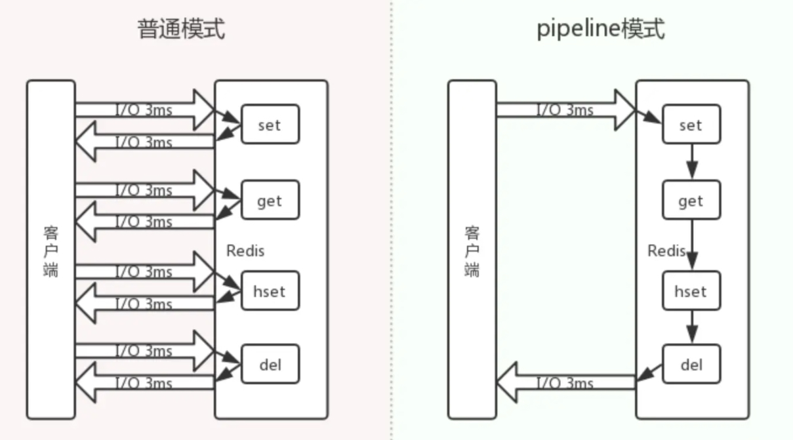
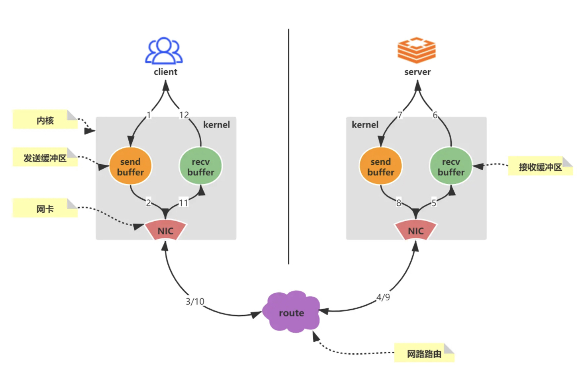
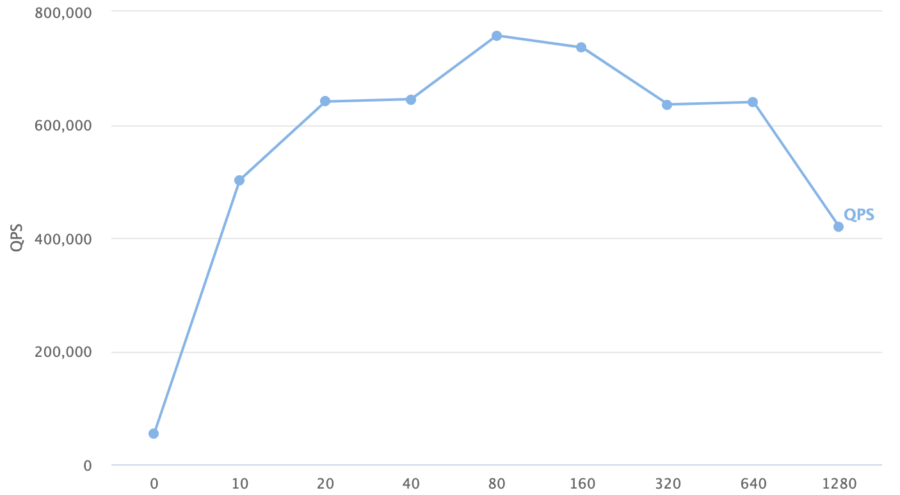

# Pipeline

## 概述

redis是基于Request/Response的tcp服务，其每次处理请求会经历如下步骤：

1. 发送命令
2. 命令排队
3. 命令执行
4. 结果响应

Redis的客户端和服务端之间通过网络连接传输数据，无论网络的延迟如何，数据包总是能从客户端到达服务器，并从服务器返回数据回复客户端，这个时间被称之为RTT(Round Trip Time - 往返时间)。当客户端连续请求服务端的时候，即使服务端处理请求的性能很高，但是由于RTT的存在，在网络传输过程中花费了大量的时间，导致整体性能下降。Redis提供了pipeline改善上述问题，其可以将一组命令进行组装，通过一次传输发给Redis进行处理，并返回结果集，其过程如图所示：

## 原理

如图所示，展示了redis客户端和服务端一次完整的网络请求来回。

具体步骤概述如下：
1. 客户端调用write将数据写入操作系统内核(kernel)为socket连接分配的发送缓冲区(send buffer)

2. 客户端操作系统内核将发送缓冲区(send buffer)的数据发送到网卡(NIC)

3. 网卡(NIC)将数据通过路由(route)将数据送到Redis服务器机器网卡(NIC)

4. 

5. 服务器操作系统内核(kernel)将网卡(NIC)接收的数据，写入内核为socket分配的接收缓冲区(recv buffer)

6. 服务器进程从接收缓冲区调用read读取数据，并进行数据逻辑处理

7. 数据处理完成之后，服务器进程调用write将响应数据写入操作系统内核为socket分配的发送缓冲区

8. 操作系统内核将发送缓冲区的数据发送到服务器网卡

9. 服务器网卡将响应数据通过路由发送到客户端网卡

10. 

11. 客户端网卡接收响应数据

12. 客户端操作系统内核读取网卡接收到的服务器响应数据，并写入操作系统为socket连接分配的介绍缓冲区

    客户端进程调用read从接收缓冲区中读取服务器响应数据

使用pipeline技术，就是将`n*12`个步骤，合并成`1*12`次处理，不仅大大减少了网络IO的次数，减少RRT的耗时，同时减少了调用read()和write()系统方法，减少了用户态和内核态切换的次数。

此外，由于如果一次处理的命令数量过多，会引起io阻塞，降低效率，其原因为：如果一次处理的命令数量过多，那么接受缓冲区和发送缓冲区都可能会发生io阻塞，导致整个请求的时间变长。因此在处理大批量的命令时，可以将命令划分为合理的批次，减少阻塞的出现，也可以避免服务器响应一个过大的答复包，导致内存负载过重。

## 性能测试

在网络延迟为43ms的情况下，进行了性能测试，结果如表所示：

| 使用pipeline | 处理命令总数量 | 每批次命令数量 | 耗时(ms)  |
| :----------: | :------------- | -------------- | --------- |
|      否      | 10000          |                | 289638604 |
|      是      | 10000          | 100            | 4452807   |
|      是      | 10000          | 500            | 1357554   |
|      是      | 10000          | 1000           | 1366666   |
|      是      | 1000000        | 5000           | 19433717  |
|      是      | 1000000        | 10000          | 15931426  |
|      是      | 1000000        | 50000          | 15483187  |
|      是      | 1000000        | 100000         | 15951461  |
|      是      | 1000000        | 500000         | 25302214  |

从实验结果可以发现：

* 使用pipeline，处理10000命令的时间相较于未使用pipeline有大幅度的降低，性能提示非常明显
* 每批次命令的数量数量会影响耗时，数量过小或过大都会导致耗时增加

上述实验主要是在客户端进行，此外还进行了服务端的实验，使用redis-benchmark进行性能压测，命令如下：

~~~sh
./redis-benchmark  set -q -P n
~~~

n表示pipeline的数量，实验结果如下：

## 适用场景

`Peline`是 Redis 的一个提高吞吐量的机制，适用于**多 key 读写场景**，比如同时读取多个`key` 的`value`，或者更新多个`key`的`value`，并且允许一定比例的**写入失败**、**实时性**也没那么高，那么这种场景就可以使用了。比如 10000 条一下进入 redis，可能失败了 2 条无所谓，后期有补偿机制就行了，像短信群发这种场景，这时候用 pipeline 最好了。

## 批量命令、Pipeline 对比

1. 原生批量命令是原子的，Pipeline 是非原子的。
2. 原生批量命令是一个命令对应多个 key，Pipeline 支持多个命令。
3. 原生批量命令是 Redis 服务端支持实现的，而 Pipeline 需要服务端和客户端的共同实现
