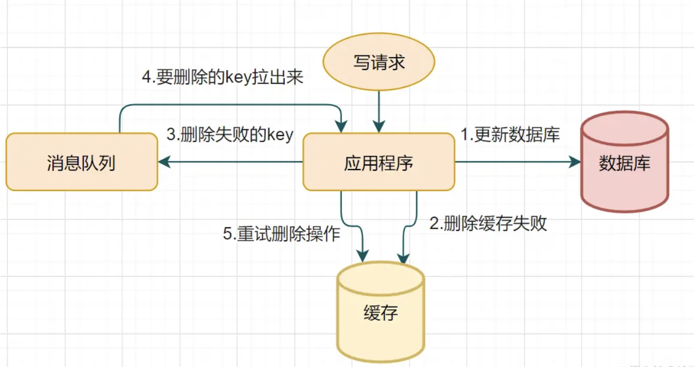

# 缓存与数据库的一致性

## 缓存与数据库的一致性

### 一致性

一致性指“`all nodes see the same data at the same time`”，即所有节点在同一时间的数据完全一致。对于一致性可以大概分为三类：

* **强一致性**：当数据更新之后的任意时刻任意用户或进程的查询到的数据都是最新的数据。
* **弱一致性**：数据更新之后，不保证获取到的一定是最新的的值
* **最终一致性**：数据更新之后，并不会立即符合一致性要求，但系统会保证在一定时间段之后，能够达到一个数据一致的状态。

### 三种缓存模式

缓存可以提升性能，降低数据库的压力，但是由于对缓存及数据库的更新不是原子性的，会存在数据不一致的问题。结果该问题，有三种经典方案：Cache-Aside Pattern、Read-Through/Write through、Write behind

#### Cache-Aside Pattern

对于读数据的情况，具体的流程如图所示：

首先，判断缓存中是否存在目标数据，如果存在直接读缓存返回数据，如果不存在则从数据库中读数据返回，并将该数据写入缓存中。

对于写的情况，具体的流程图如下：

**为什么是删除缓存而不是更新缓存？**

以一个实例里介绍为什么是删除缓存而不是更新缓存

线程A、B都需要对同一个数据进行修改，执行步骤如下：

1. A写入数据库
2. B写入数据库
3. B更新了缓存
4. A更新缓存

理想情况下，A应先于B更新缓存，但是可能由于网络等问题B先于A更新了缓存，导致最后缓存中保存的数据是A数据，而数据库中保存的是最新的B数据，数据不一致，且不是最新的数据。如果是删除缓存则不会出现上述问题。

同时，删除缓存相较于更新缓存，还有其他的优势：

* 删除相较于更新更加简单，尤其是对需要复杂计算更新的缓存值，会浪费性能
* 数据在被读取之前可能经历多次写操作之后才会被读取，如果采用更新的策略，那么其中多次更新都会被覆盖，是无效的操作，浪费资源。

#### Read-Through/Write through(读写穿透)

Read-Through/Write through中将缓存作为主要的数据存储，从中读取数据并直接更新数据，然后由缓存服务写数据至数据库或从数据库读数据。

**Read-Through**

Read-Through Pattern 实际只是在 Cache-Aside Pattern 之上进行了封装。在 Cache-Aside Pattern 下，发生读请求的时候，如果缓存中不存在对应的数据，是由客户端自己负责把数据写入缓存，而 Read Through Pattern 则是缓存服务自己从数据库中拿到数据写入缓存。

**Write through**

Write through在更新数据的时候，会首先检查缓存中时候存在对应数据，如果存在则直接更新缓存，然后由缓存服务更新数据库，如果不存在对应数据，则直接更新数据库。

#### Write behind

Write behind和Read-Through/Write through较为相似，都是由缓存服务控制缓存和数据库的同步，客户端直接操作缓存进行数据的读写。不同的是，更新数据时，Write behind只会更新缓存，不会同步更新数据库，而是由缓存服务异步地批量更新数据库。

因为异步的存在可以将对数据库同一数据的多次操作合并一次用于更新数据库，提高了性能。

同时也存在问题，缓存与数据库的数据不是强一致性的，可能会导致数据丢失。

### 先删除缓存还是先更新数据库？

为什么Cache-Aside是先更新数据库，然后删除缓存，而不是先更新删除缓存，再更新数据库，下面分别举两个例子来进行说明。

* 先删缓存，然后更新数据库

线程A进行数据写入，线程B进行数据的读取，首先由A删除缓存中的数据，然后写入数据库，此时B读取数据发现缓存中没有数据，就直接从数据库中读取数据，由于写操作的时间一般长于读操作，B可能读取到的是A写入之前的旧数据，此后将其更新至了缓存中，就会导致缓存中存储的是脏数据。

*   先更新数据库，然后删除缓存

    较为糟糕的情况可能是：

    1. 缓存已失效
    2. B从数据库中读取旧数据
    3. A对数据库数据进行修改
    4. A删除缓存数据
    5. B更新旧数据至缓存

    虽然，这种情况最终也会导致缓存中存在的数据是脏数据，但是由于读数据的速度要高于写数据，所以在2与5之间出现的第3、4步的概率较小，多数情况下要由于先删缓存再操作数据库。

#### 缓存延时双删

采用延时双删可以有效改善上述情况，减少数据库与缓存不一致出现的概率。

其主要特点是在写入数据库之后，延时一段时间再对缓存进行删除，确保由其他线程读取数据库数据之后的写入缓存中的数据（可能是旧数据）被删除。

有部分开发者对于是否需要第一次删除存在争议，我认为其存在的目的是减少读线程读取到旧数据的概率，如果写线程没有在写入数据库之前删除缓存中的数据，那么读线程在写线程进行延时删之前一定读取到的是旧的数据，如果采用双删的策略，那么读线程一定会去数据库中读取数据，虽然也有可能会读取到旧的数据，但也有可能是在写线程完成写入数据之后读取到新的数据，提高了写线程读取新数据的可能性。

#### 删除重试机制

无论是Cache-Aside还是延迟删，第二步删除的成功都十分重要，如果删除失败会导致脏数据长时间存在缓存之中，因此需要采用删除重试机制保证此删除一定可以成功。

1. 写请求更新数据库
2. 缓存因为某些原因，删除失败
3. 把删除失败的key放到消息队列
4. 消费消息队列的消息，获取要删除的key
5. 重试删除缓存操作

## 参考文献

1. [美团二面：Redis与MySQL双写一致性如何保证？](https://juejin.cn/post/6964531365643550751#heading-11)
2. [缓存更新的套路](https://leokongwq.github.io/2016/12/30/the-pattern-updateCache.html)
3. [Redis与Mysql双写一致性方案解析](https://zhuanlan.zhihu.com/p/59167071)
4. [Cache-Aside pattern](https://docs.microsoft.com/en-us/azure/architecture/patterns/cache-aside)
5. [谈谈分布式系统的CAP理论](https://zhuanlan.zhihu.com/p/33999708)
